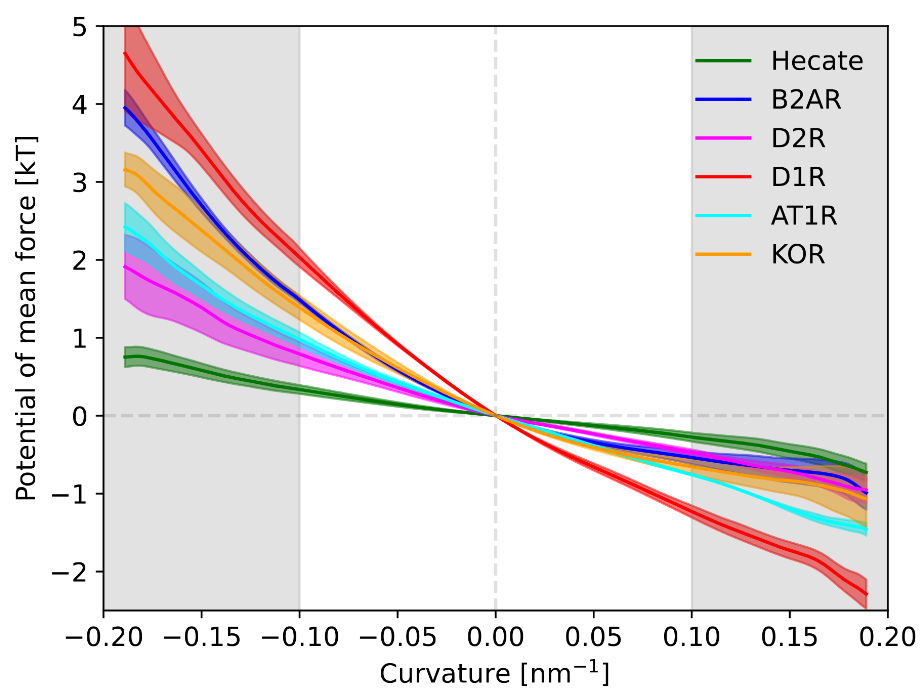

# Nielsen2026
MD scripts for Nielsen et al. 2026 DOI here when published

## curvature sensing simualtions
all scripts for curvature simulations are in main folder - starting point is Flow.sh - which calls the other files, generates files and folders, etc. 

simulated data are not here in the github repo but can be generated by the available files and scripts (see details in paper), and Flow.sh.

  

## Binding simulations
all scripts relating to peptide-lipid binding simulations are provided in the "Binding" folder. 

simulated data are not here in the github repo but can be generated by the available files and scripts (see details in paper), and Binding/Flow.sh.

