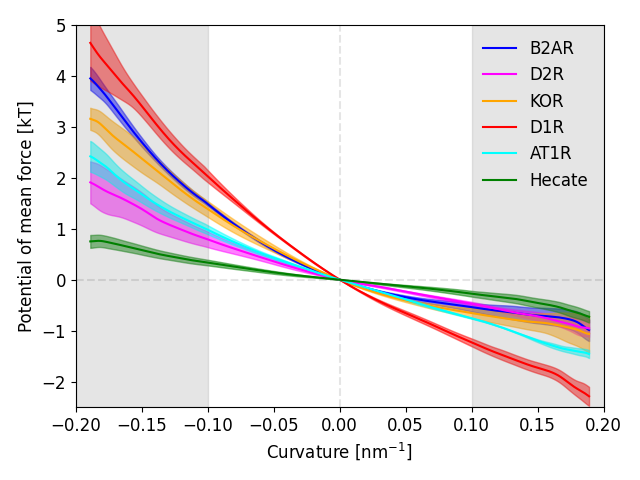
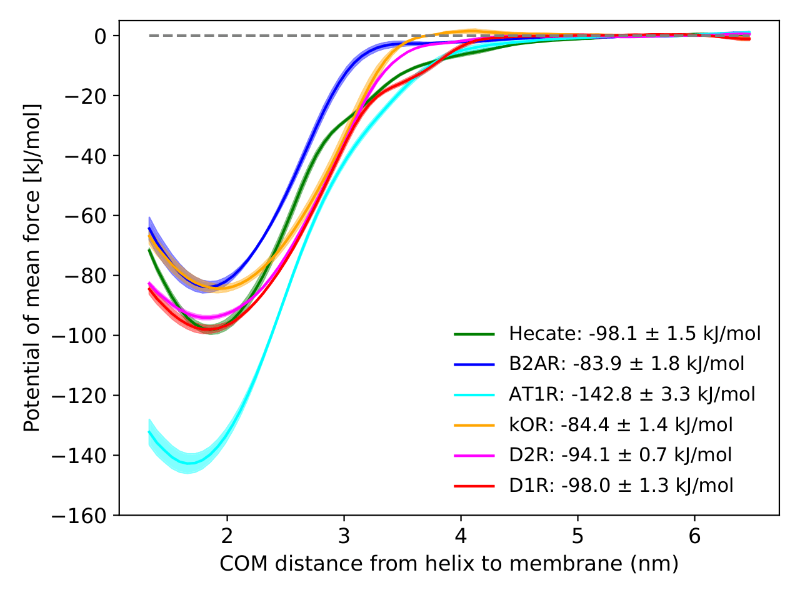

# Nielsen2026
MD scripts for Nielsen et al. 2026: [https://doi.org/10.1016/j.jmb.2026.169979](https://doi.org/10.1016/j.jmb.2026.169979)

## Curvature sensing simualations
All scripts for curvature simulations are in the "Curvature" folder - starting point is the bash script ``Flow.sh``, which calls the other files, generates files and folders, etc. 

simulated data are not here in the github repo but can be generated by the available files and scripts (see details in the paper), and ```Curvature/Flow.sh```.

<p align="center" id="dumbbell">
  
</p>

## Binding simulations
All scripts relating to peptide-lipid binding simulations are provided in the "Binding" folder - starting point are the bash scripts ``Flow.sh`` and ``Flow_idp.sh``. The first for binding sims, the latter for generating unfolded versions of the peptides ("idp" for intrinsically disordered peptide)

simulated data are not here in the github repo but can be generated by the available files and scripts (see details in the paper), and the bash scripts ``Binding/Flow.sh`` and ``Binding/Flow_idp.sh``.

<p align="center" id="dumbbell">
  
</p>
